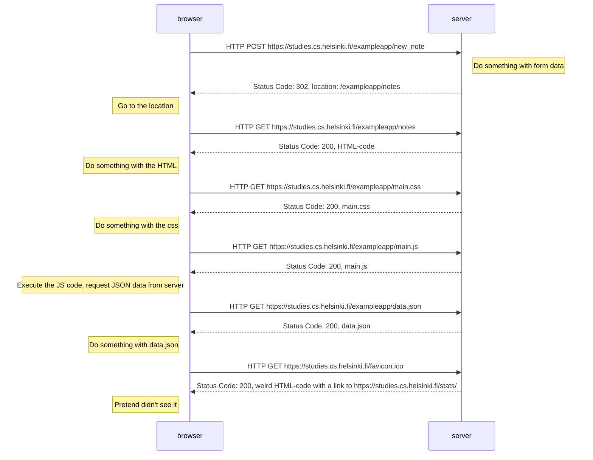

```mermaid
sequenceDiagram
    participant B as browser
    participant S as server
B->>S: HTTP POST https://studies.cs.helsinki.fi/exampleapp/new_note
Note right of S: Do something with form data
S-->>B: Status Code: 302, location: /exampleapp/notes
Note left of B: Go to the location
B->>S: HTTP GET https://studies.cs.helsinki.fi/exampleapp/notes
S-->>B: Status Code: 200, HTML-code
Note left of B: Do something with the HTML
B->>S: HTTP GET https://studies.cs.helsinki.fi/exampleapp/main.css
S-->>B: Status Code: 200, main.css
Note left of B: Do something with the css
B->>S: HTTP GET https://studies.cs.helsinki.fi/exampleapp/main.js
S-->>B: Status Code: 200, main.js
Note left of B: Execute the JS code, request JSON data from server
B->>S: HTTP GET https://studies.cs.helsinki.fi/exampleapp/data.json
S-->>B: Status Code: 200, data.json
Note left of B: Do something with data.json
B->>S: HTTP GET https://studies.cs.helsinki.fi/favicon.ico
S-->>B: Status Code: 200, weird HTML-code with a link to https://studies.cs.helsinki.fi/stats/
Note left of B: Pretend didn't see it
```
