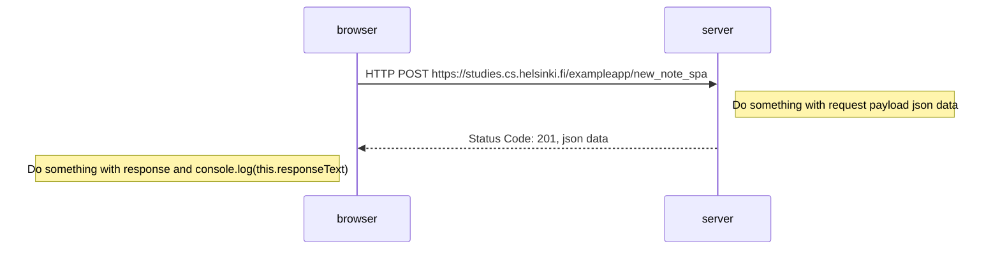

```mermaid
sequenceDiagram
    participant B as browser
    participant S as server
B->>S: HTTP POST https://studies.cs.helsinki.fi/exampleapp/new_note_spa
Note right of S: Do something with request payload json data
S-->>B: Status Code: 201, json data
Note left of B: Do something with response and console.log(this.responseText)
```
